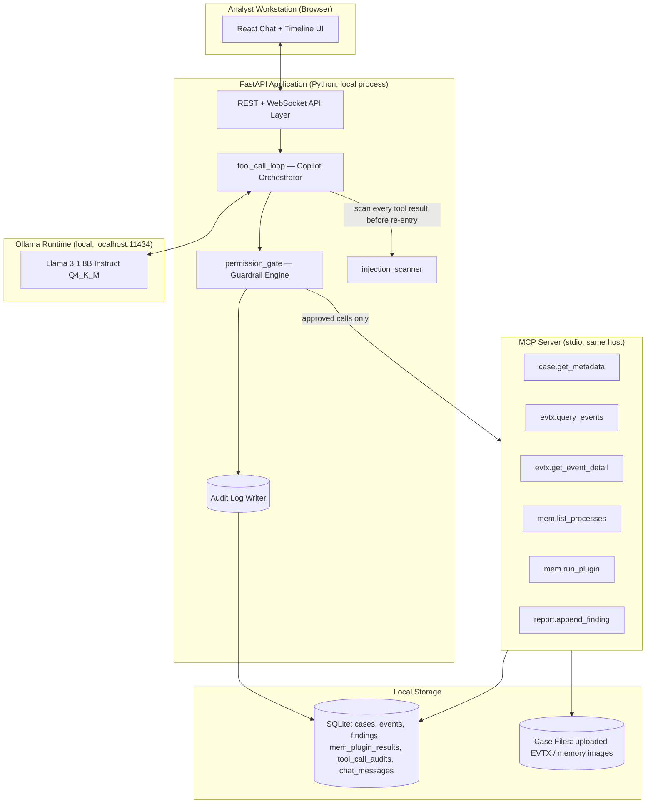

# GoLogs — High-Level Architecture

Adapted from the PRD's original §10.1 diagram to name the six tools as
actually implemented (the PRD's draft used illustrative placeholder names
including `evtx.parse_logs`, which doesn't exist as a separate on-demand
tool in the as-built system — parsing happens automatically during case
ingestion; `evtx.get_event_detail` and `report.append_finding` were added
to reflect the real six-tool surface documented in `docs/context_transfer.md`
§8).

## Reading this diagram

- **Every tool call is gated twice**: once by `permission_gate` (before
  execution — deny-list + confirmation requirement) and once by
  `injection_scanner` (after execution, before the result re-enters the
  model's context). Neither check trusts the other.
- **The model never talks to the MCP server directly.** `tool_call_loop`
  sits between them; a compromised or hallucinating model can *request*
  a tool call, but cannot cause one to execute without passing through
  `GUARD`.
- **No arrow leaves the box.** There is no cloud LLM call, no telemetry
  endpoint, no external API dependency in the investigation loop — see
  FR-12 and the Docker Architecture note (§16) on why Ollama runs
  natively rather than in a container reachable from outside the host.
